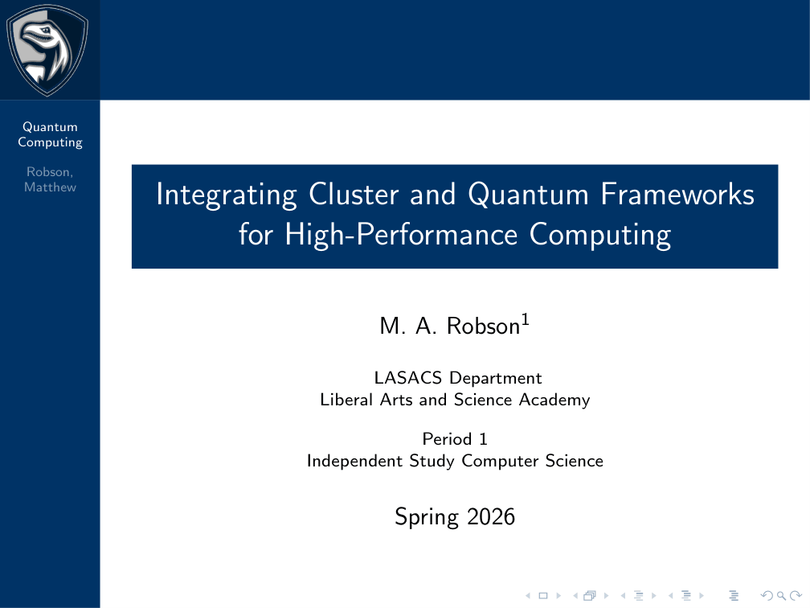
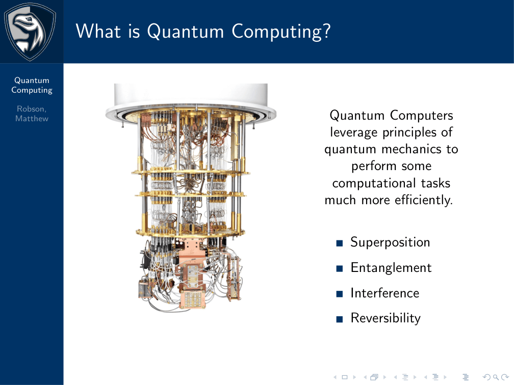
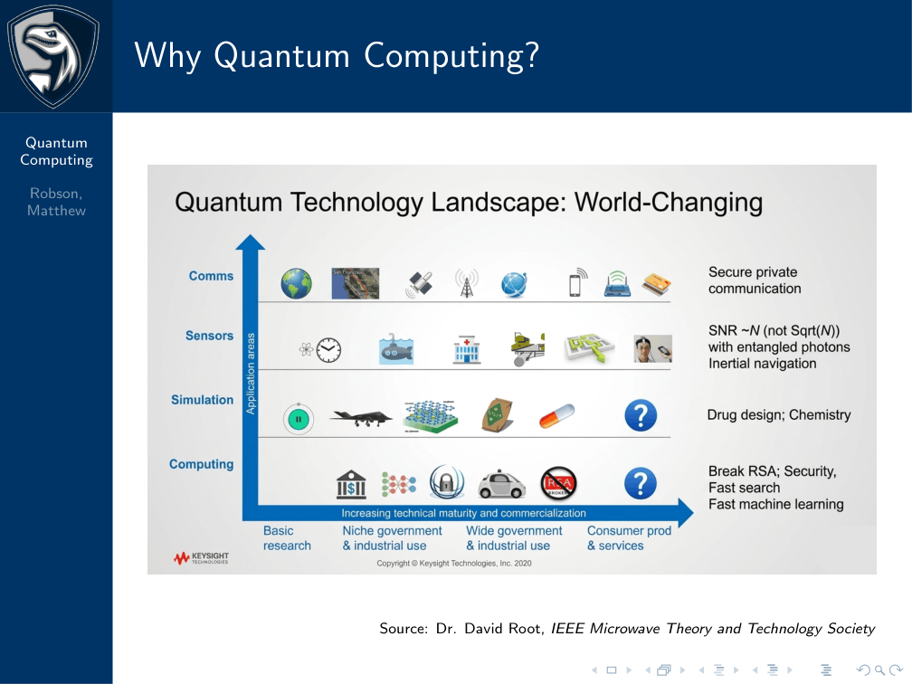
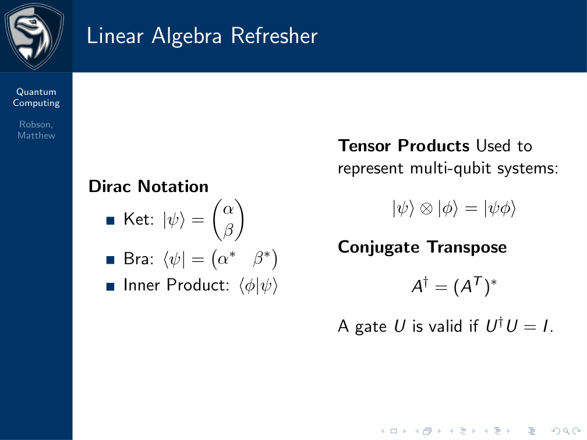
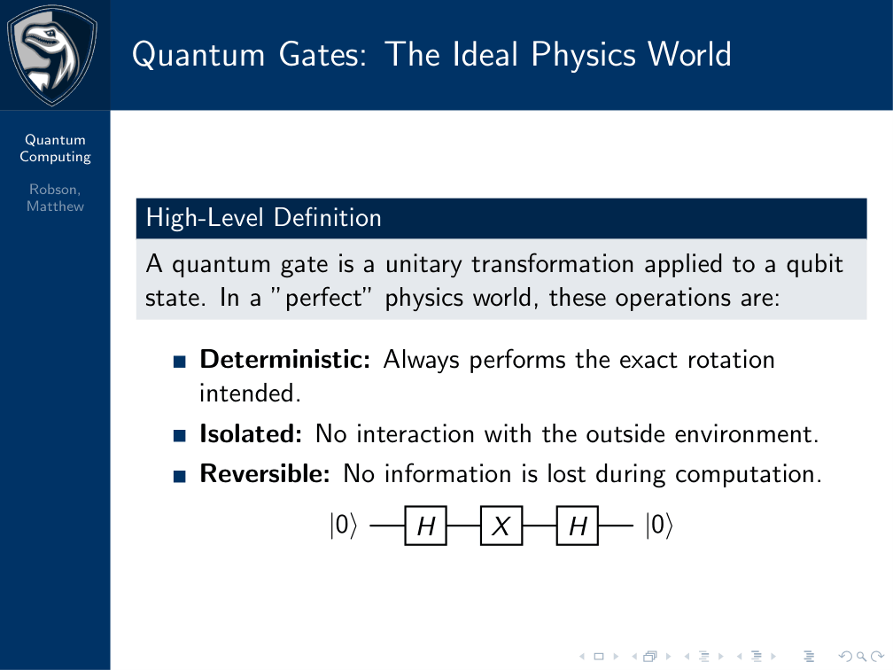
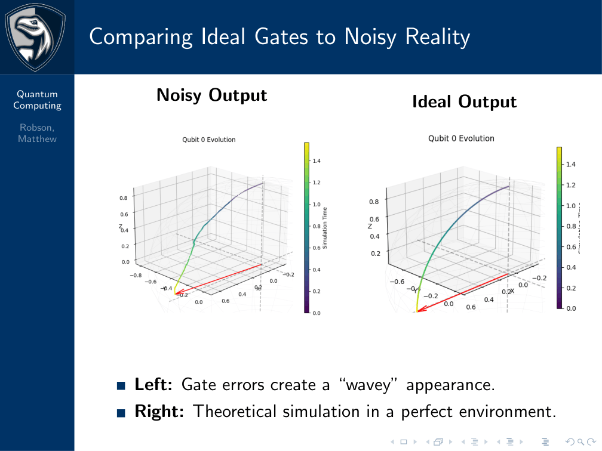
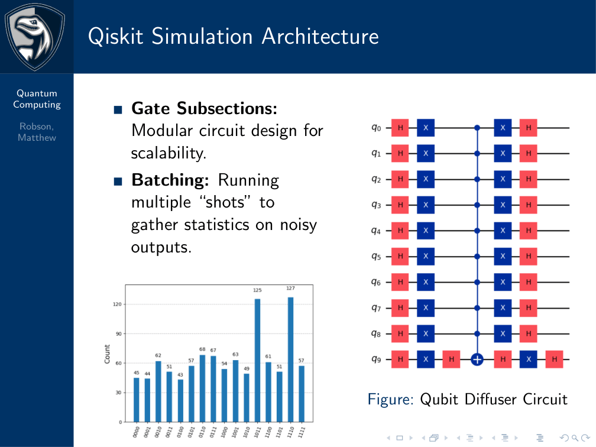
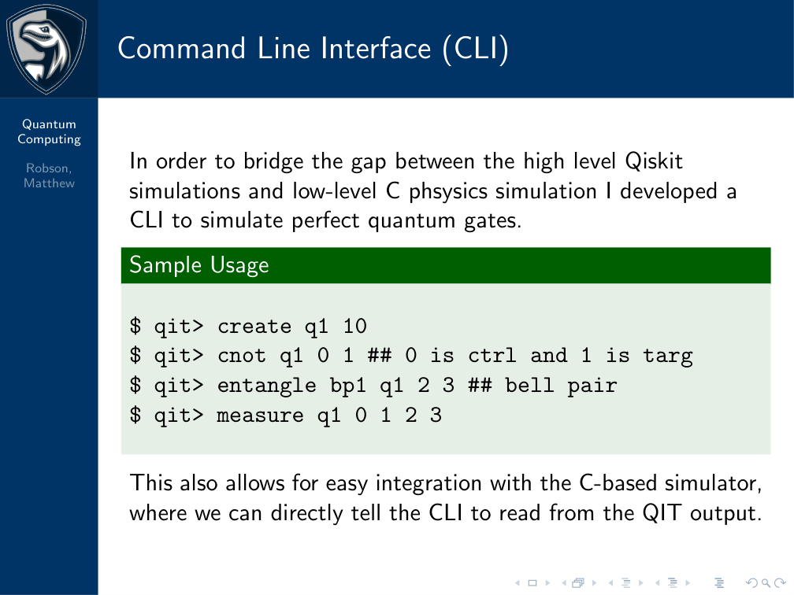
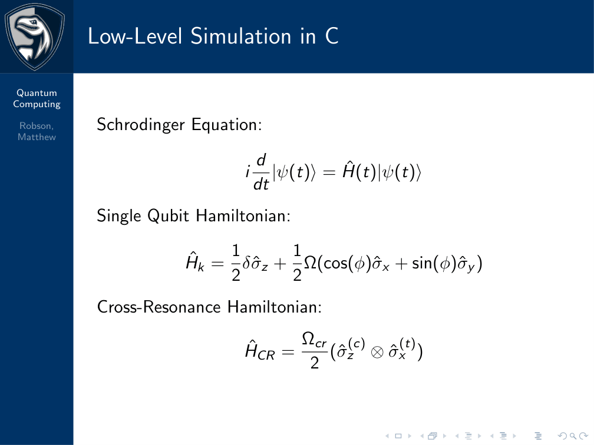
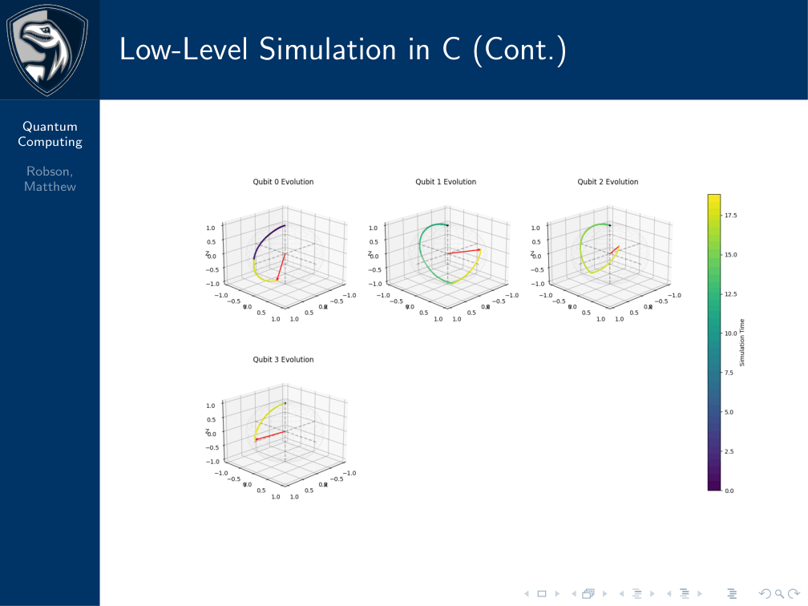

# Quantum Computing and its Applications

## Spring Presentation

<!--  -->

## Overview of Course Work

The goal of this course is for the student to gain an understanding of how quantum computing works and develop a tool to simulate the basic aspects of quantum computing on a classical computer while checking its validity with publicly open quantum computers. In addition to making a tool to simulate a quantum computer, it could prove interesting for the student to develop a basic algorithm based on post-quantum security. This course will give the student opportunities to learn of a quickly developing field in the professional world and further their understanding of low level computing. Additionally, this should be exciting for the students because quantum computing is a quickly growing sector and many projections place it to be the next big piece of technology after AI.

## Source Material

The main material that will be used is Introduction to Classical and Quantum Computing by Thomas G. Wang. This book along with additional supplements (possibly Essential Mathematics for Quantum Computing: A Beginner's Guide to Just the Math You Need Without Needless Complexities or online resources) may be used to improve the students' understanding.

## Organization

The student should follow the organization of the textbook, while using any other necessary resources. After completing the text book, the student should create a timeline to follow for the coding process.

## Deliverables

The deliverables for the first few sections of the course should be students notes and answered questions from the textbook, but as the course continues, the student should progress to sprint progress on their code.

